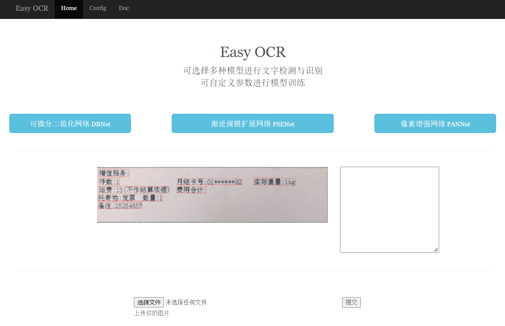
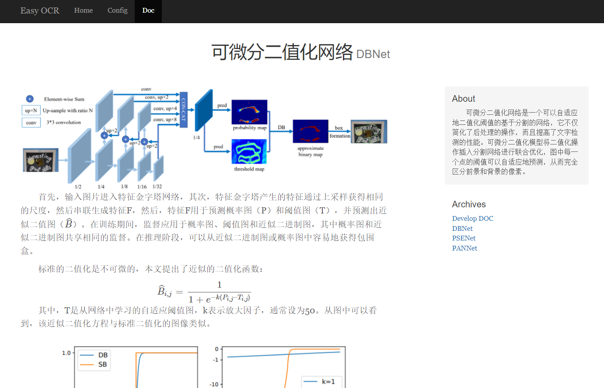
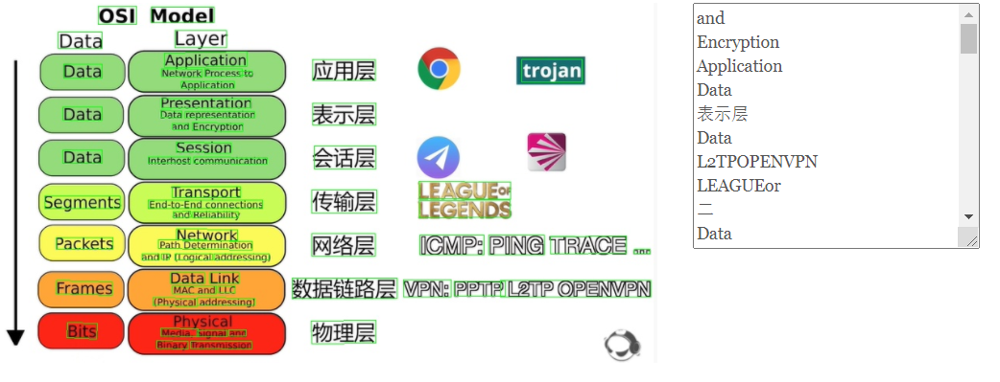
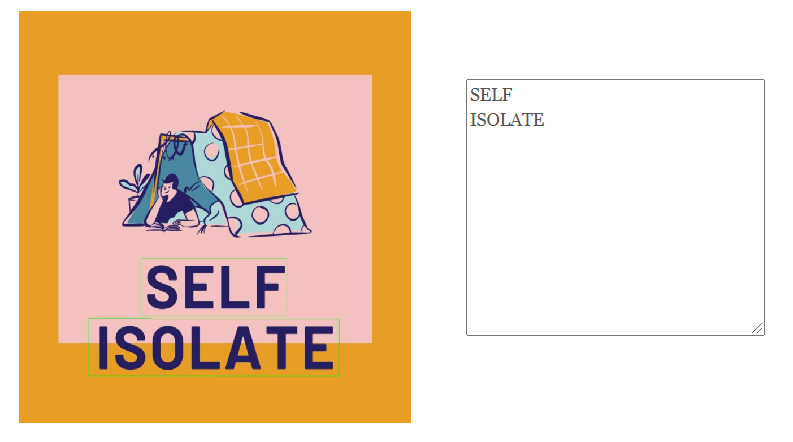
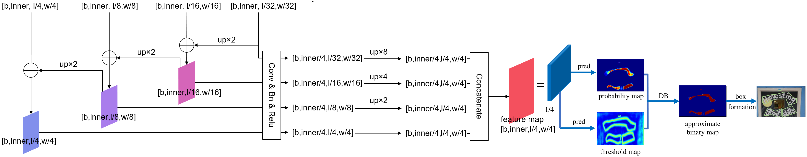
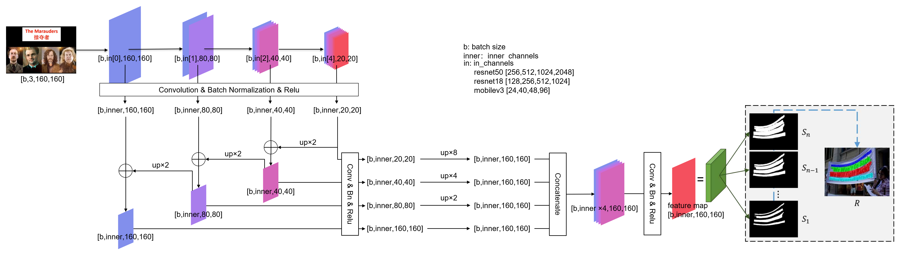
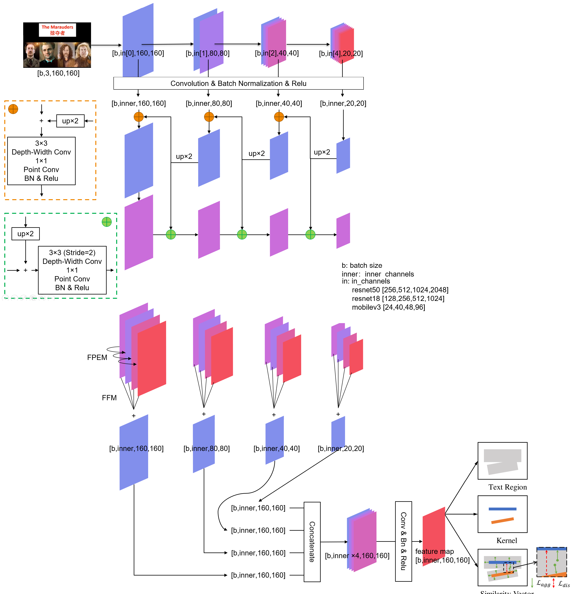
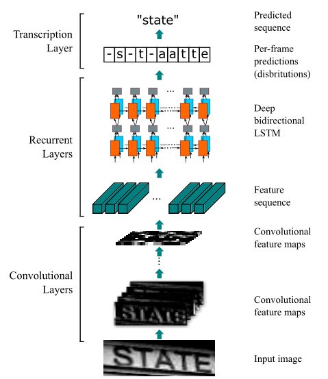

# Research and implementation of the Chinese and English text detection and recognition model in scene images

## Introduction

Optical character recognition technology is a kind of technology to locate, detect and recognize the data and text contained in the image. Through the analysis of layout and related information, the data and text information in the image can be obtained. Optical character recognition usually includes two steps: text detection and text recognition. Text detection is used to locate the text area in the image and provide the coordinate information of its location. Text recognition further recognizes all characters in the region, and converts them into binary coded character information that can be understood and processed by computer.

According to the characteristics of street view images, this paper studies and analyzes the current mainstream models in the field of text detection and recognition, and designs a complete set of processing flow of text detection and recognition tasks. In this paper, the processing process of segmentation based text detection model is divided into three stages: backbone network, up sampling segmentation head and segmentation output, and several optional functional modules are implemented in each stage. Specifically, for the backbone network, Resnet50 module and Mobilenetv3 module are selected and reproduced; for the up sampling segmentation head, the up sampling segmentation head module and the feature pyramid enhancement and fusion segmentation head module are selected and reproduced, and they are improved and optimized respectively; and for the segmented output, the incremental scale expansion network module, the pixel aggregation network module and the differentiable binary network module are selected and reproduced. A different text detection model can be obtained by selecting any module in each stage. Through the comparison and analysis of the accuracy of training results, convergence speed, model size and other aspects, we can get the most suitable model in different scenarios. In addition, this paper also implements a character recognition algorithm on Chinese and English character set, which needs to consider the characteristics and differences of Chinese and English characters at the same time. At the same time, thin plate spline interpolation is introduced to repair the input text.

Finally, this paper designs and implements an online system for text detection and recognition, which can provide Chinese and English image text detection and recognition services for common scenes. The system can accept the user's image input through the visual interactive interface. After the above text detection and recognition model and post-processing process, the system returns the structured text extraction results and visual presentation to the user.

## Anaconda setup

Once Anaconda is installed, you can create a new environment with:
```shell
conda create --name ocr python=3.7
```

## Install locally
Once you have created your Python environment you can simply type:
```shell
git clone git@github.com:hyc2026/ocr.git
cd ocr
pip install -r requirements.txt
```

## Train
1. 修改./config中对应算法的yaml中参数，基本上只需修改数据路径即可。
2. 运行下面命令

```shell
python3 tools/det_train.py --config ./config/det_DB_mobilev3.yaml --log_str train_log  --n_epoch 1200 --start_val 600 --base_lr 0.002 --gpu_id 2
```

### 断点恢复训练
将yaml文件中base下的restore置为True,restore_file填上恢复训练的模型地址，运行：
```shell
python3 tools/det_train.py --config ./config/det_DB_mobilev3.yaml --log_str train_log  --n_epoch 1200 --start_val 600 --base_lr 0.002 --gpu_id 2
```

## Django website

```shell
cd mysite
python manage.py runserver
```

### 效果展示









## 神经网络结构展示

### DBNet



### PSENet



### PANet



### CRNNet



## Document

```
https://github.com/hyc2026/ocr/blob/master/Research_and_implementation_of_the_Chinese_and_English_text_detection_and_recognition_model_in_scene_images.pdf
```

